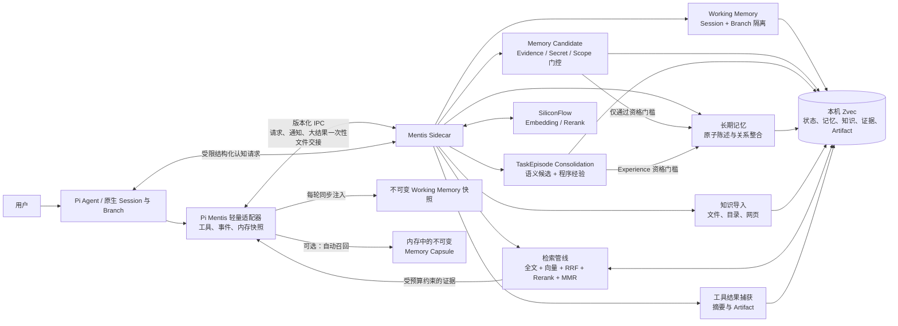

# Pi Mentis


## 说明

> 面向 [Pi](https://github.com/badlogic/pi-mono) 的本地优先长期记忆与知识库：让 Agent 记住偏好、决策和项目上下文，并在需要时检索，而不是把所有历史一直塞进模型上下文。

Pi Mentis 为 Pi `>= 0.84.0` 提供持续工作记忆、跨会话长期记忆、可导入文件和网页的知识库，以及针对大工具输出的 Artifact 按需检索。它复用 Pi 原生的 Session 和 Branch 语义，不维护第二套会话树。

## 安装

### 1. 准备环境

| 项目     | 要求                           |
| -------- | ------------------------------ |
| Pi       | `>= 0.84.0`                    |
| Node.js  | `>= 22.19.0`                   |
| 推理服务 | SiliconFlow API Key            |
| 数据库   | 本机 Zvec（由 Pi Mentis 管理） |

### 2. 安装一个产品

三个产品共用同一套本地数据目录，**请选择其一安装**。通常直接选集成版。

| 包                               | 适用场景                    | 可用能力                                |
| -------------------------------- | --------------------------- | --------------------------------------- |
| `@galvinsan/pi-mentis`           | **推荐**：知识库 + 长期记忆 | `commit_memory`、`search_memory`、`/kb` |
| `@galvinsan/pi-mentis-memory`    | 仅个人长期记忆              | `commit_memory`、`search_memory`        |
| `@galvinsan/pi-mentis-knowledge` | 仅知识库                    | `commit_knowledge`、`search_knowledge`  |

```bash
pi install npm:@galvinsan/pi-mentis
```

升级或卸载：

```bash
pi update npm:@galvinsan/pi-mentis
pi remove npm:@galvinsan/pi-mentis
```

### 3. 配置凭证并验证

API Key 只放在环境变量中，不要写入配置文件。

```bash
export SILICONFLOW_API_KEY="your-api-key"
pi
```

在 Pi 中执行：

```text
/mentis doctor
```

它会只读检查 Pi 版本、凭证变量、存储配置和 Sidecar 状态，不会发起模型请求，也不会显示 API Key。`/mentis help` 会显示当前实际使用的配置文件路径和完整帮助。

## 使用

### 连续推进当前任务

Working Memory 默认开启。你可以连续说“继续”“按刚才的方向修复”“先处理剩余失败项”，Pi Mentis 会保留当前目标、已确认事实、决策、假设、未完成事项、最近结果和 Artifact 引用。它按原生 Session + Branch 隔离，重启或压缩后恢复；分叉会复制起点，但子分支之后的变化不会污染父分支。

Working Memory 与自动 Capsule 共享统一的模型可见预算（默认 `1200` tokens）。系统先保留当前 Goal、Open loops 和 Decisions，再用剩余预算注入已确认事实与长期记忆，避免“已经知道什么”挤掉“现在还要做什么”。

这条能力不依赖自动召回，即使 `retrieval.automaticRecall` 为 `false` 也会工作。每轮开始只注入 Sidecar 已发布到内存中的有界快照，不读取磁盘、不查询 Zvec、也不发起模型或 IPC 请求。

### 让 Agent 记住长期信息

直接用自然语言告诉 Pi；只有你明确要求记住、更新、纠正或忘记时，Pi 才应写入长期记忆。

```text
请记住：我在 Node.js 项目中优先使用 pnpm，并且默认开启 TypeScript 严格模式。
```

Pi 会调用 `commit_memory({ content })`。公开写入接口只有一项自然语言内容，无需填写标签、谓词、记忆类型或事实键。

### 检索已有记忆和知识

```text
请搜索我关于 Node.js 包管理器的长期偏好。
```

Pi 会调用 `search_memory`。集成版的搜索会同时检索个人记忆和知识库；当信息不在当前上下文、存在不确定性或可能来自历史记录时，Pi Mentis 会提示 Agent 先搜索再回答。

要纠正旧信息，先让 Agent 搜到具体旧记录，再写入新的陈述：

```text
先搜索我之前的包管理器偏好，然后更新为：这个项目改用 npm workspaces。
```

### 导入知识库

集成版和知识库版支持文件、目录、Git 工作区和网页：

```text
/kb add ./docs
/kb add https://zhanghandong.github.io/pi-book/
/kb status
/kb help
```

导入任务在后台执行，Pi 前台不会因索引或大文件解析而被阻塞。

## 核心功能

### 长期记忆：写入快、整合慢

每条记忆先以带来源和时间的原子陈述保存。后续的强化、替代、撤回或冲突判断在后台进行；相似度只用于寻找候选，不能单独改变记忆状态。这样既能支持偏好和决策的演进，也能保留可追溯的原始记录。

### 自动记忆形成：候选先行、默认不落库

显式 `commit_memory` 仍是最高优先级写入入口。除此之外，Sidecar 会先用廉价规则识别明确承诺、纠正和稳定偏好，再调用当前 Pi 模型生成结构化 Memory Candidate。候选必须通过来源、Evidence、Secret、Scope 和稳定性门控；默认 `autoPromotion: false`，因此只在隔离的候选状态中观察和强化，不参与召回，也不会静默写入长期记忆。

### Episode Consolidation：从任务结果学习

同一 Task 的多个 Episode 会聚合为有界摘要，只引用 Artifact ID，不复制大结果。成功验证或失败验证可触发后台归纳：语义结论仍进入 Candidate 管线；程序经验需要不同 Evidence 的重复结果，并通过 Beta 成功率门槛后，才由 Experience 服务提交为可复用过程。Steering 之前被放弃的执行路径不会被当成成功经验。

### 知识库：混合检索、按预算返回

知识与记忆候选会经过全文检索、向量检索、RRF 融合、权限/时效门控、可选 Rerank、去重和 MMR 多样性选择。最后按上下文预算挑选信息密度最高的内容，而不是简单塞入固定数量的片段。

### 大结果不反复占用上下文

工具结果默认按大小处理：

| 结果大小   | 模型看到的内容                    | 完整内容   |
| ---------- | --------------------------------- | ---------- |
| `≤ 8 KiB`  | 原样返回                          | 当前上下文 |
| `8–64 KiB` | 摘要 + 一份 preview + Artifact ID | Artifact   |
| `> 64 KiB` | 结构化摘要 + Artifact ID          | Artifact   |

完整 `read` 结果（最多 256 KiB）会在首次读取时提供给模型，并存为 Artifact；相同路径、范围且内容未变时，后续读取只返回引用。文件内容变化后会再次完整提供。需要细节时，Agent 可使用 `search_memory({ id, query })` 在对应 Artifact 内定位局部窗口。

### 可选自动召回

自动召回默认关闭。开启后，Sidecar 在每轮结束后生成 Memory Capsule；下一轮开始时，Pi 只从已加载的不可变 Capsule 中选择少量证据，不访问磁盘、Zvec 或网络。完整语义检索仍由 `search_memory` 在 Sidecar 中执行。

```json
{
  "retrieval": { "automaticRecall": true }
}
```

开启后会增加提示词内容和后台刷新工作，发送消息后可能出现可感知延迟。

## 系统架构



Pi 进程只保留轻量适配器和可选的内存 Capsule；Zvec、远程推理、知识导入、工具结果捕获和后台维护都运行在独立 Sidecar 中。Sidecar 异常时 Pi 仍可继续使用，并会按退避策略尝试恢复。

## 配置、数据与安全

- 默认配置文件：`~/.pi/.pi-mentis/config.json`；可使用 `PI_MENTIS_HOME` 指定独立的绝对路径。
- 默认数据目录：`~/.pi/.pi-mentis/zvec`；同一目录只允许一个写入进程。
- 备份前先停止 Pi，再整体复制 `storage.rootDir`。
- 召回内容会作为不受信任的证据提供给 Agent，不能覆盖当前用户指令。
- 详细字段、模型设置、资源限制与存储迁移请参阅 [配置文档](https://github.com/guchengod/pi-mentis/blob/main/docs/configuration.md)。

## 开发

仓库是 ESM TypeScript monorepo，使用 pnpm：

```bash
pnpm install
pnpm format:check
pnpm lint
pnpm typecheck
pnpm test
pnpm test:e2e
pnpm build
pnpm pack:extensions
```

更多设计细节见 [认知记忆](https://github.com/guchengod/pi-mentis/blob/main/docs/cognitive-memory.md)、[系统架构](https://github.com/guchengod/pi-mentis/blob/main/docs/architecture.md)、[数据模型](https://github.com/guchengod/pi-mentis/blob/main/docs/data-model.md)、[检索机制](https://github.com/guchengod/pi-mentis/blob/main/docs/retrieval.md)、[测试说明](https://github.com/guchengod/pi-mentis/blob/main/docs/testing.md) 和各 npm 包：

- [集成版 `@galvinsan/pi-mentis`](https://www.npmjs.com/package/@galvinsan/pi-mentis)
- [记忆版 `@galvinsan/pi-mentis-memory`](https://www.npmjs.com/package/@galvinsan/pi-mentis-memory)
- [知识库版 `@galvinsan/pi-mentis-knowledge`](https://www.npmjs.com/package/@galvinsan/pi-mentis-knowledge)

MIT License.
